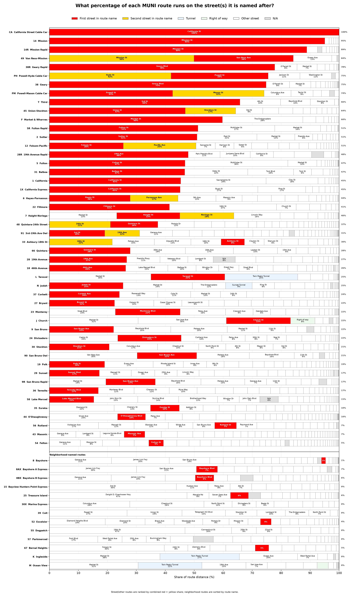
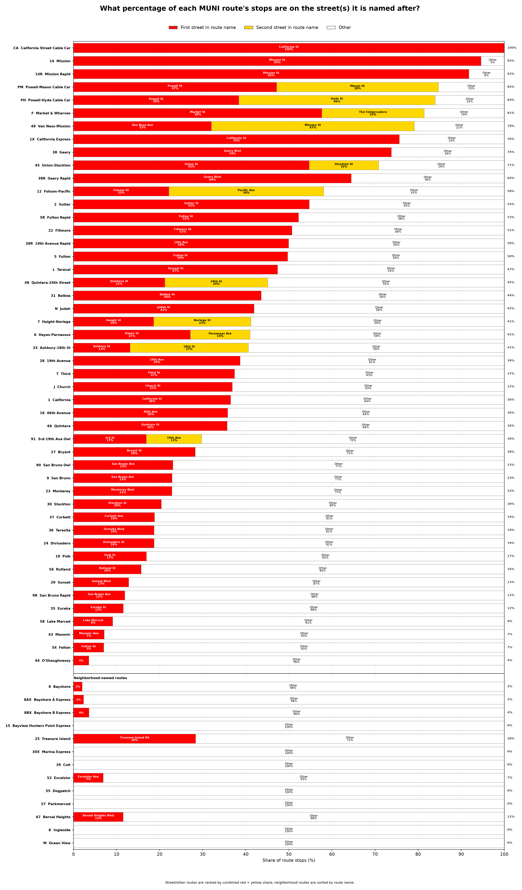

# MUNI route name analysis
One interesting fact about the San Francisco Muni system is that routes have names in addition to their number or letter designations. “14 Mission” and “N Judah” aren’t just convenient names used in announcements—they’re the official route names used by SFMTA. Some of these routes are well named: "38 Geary" traverses almost entirely along Geary Blvd and Geary St, and "49 Van Ness / Mission" makes it way down from North Beach via Van Ness, and then Mission. Some, however, are not so obvious: "43 Masonic", for example, runs across the entire city, with only a small portion on Masonic Street. So exactly how well are each MUNI routes names? In this analysis we (me & ChatGPT) answer the question.

We breakdown the answer in two parts: first, what percentage does each route run on the named street(s)? And second, what percentage of stops of each route is on the named street(s)? We present the answers below:



We provide raw data in `csv` files. To fetch and analyze data, obtain a token from [MTC 511 Open Data Portal](https://mtc.ca.gov/tools-resources/data-tools/511-open-data-portal), then set environmental variable
```
$ export MTC_511_API_KEY=<TOKEN>
```
Generate the csv files using 
```
$ bash csv_gen.bash
```
Generate the graphs using 
```
$ bash grapher.bash
```